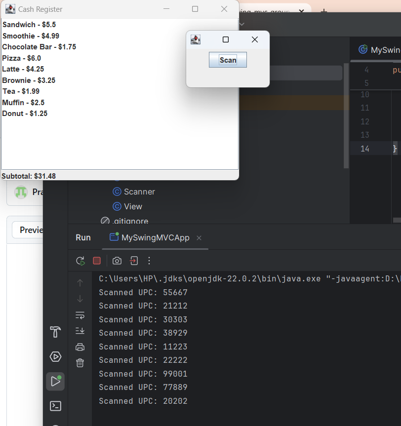
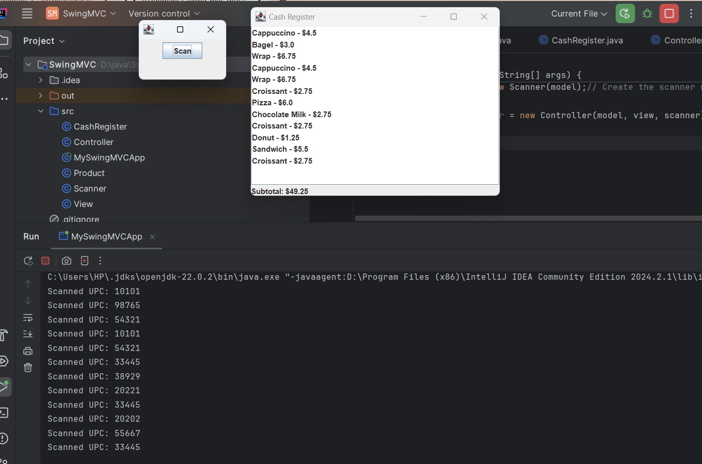

# Assignment 2: Architectural MVC Patterns and Frameworks
| Group Member Name | Student ID | Responsibility | Email ID |
|-------------------|------------|----------------|----------|
| Khushi Patel         | 100940709     | ReadME formatting, Q2, Code | khushi.patel9@ontariotechu.net |
| Prabhnoor Saini         | 100946515    | ReadME formatting, Q1, Code | prabhnoor.saini@ontariotechu.net |
| Hadia Ali         | 100876605   | Class Diagram, Sequence Diagram | hadia.ali@ontariotechu.net |

## 📌 Question 1: Swing Framework

**Q: What is the purpose of the Swing framework?** 

The Swing framework is a Java Graphical User Interface (GUI) toolkit which provides a wide range of user interface components for building graphical desktop applications. It is part of Java Foundation Classes (JFC) and is built on top of the Abstract Window Toolkit (AWT). It provides more flexible, lightweight and platform independent components than AWT. Swing also supports a pluggable look and feel feature, that allows the appearance of an interface to be changed at runtime without code modification.

Swing provides commonly used components such as JButton, JLabel, and JTextField for building interactive and user-friendly interfaces.

By implementing the Model-View-Controller (MVC) pattern across its components, Swing ensures a clear separation between data, user interface and control logic, resulting in interfaces that are easier to maintain, extend and customize.

**Class Diagram of Swing Components:**

  

## 📌 Question 2: MVC Example from GitHub Repository

**Q: How does the provided GitHub example implement the MVC pattern, and how does it differ from the conventional MVC pattern?**  

The example provided in the src files follows the **MVC pattern** by separating responsibilities into three main parts:  

### **Model (Model.java)**  
- Represents the **data part** of the pattern.  
- Stores two attributes: `firstname` and `lastname`.  
- Provides **getters and setters** to read or update these attributes.  
- Acts as a **data container**, without any complex business logic.  
### **View (View.java)**  
 - Defines the **graphical user interface (GUI)** using the **Swing framework**.  
 - Creates a `JFrame` and arranges components like `JLabel`, `JTextField`, and `JButton`.  
 - Provides **getter methods** for these components so the controller can attach listeners or retrieve inputs.  
 - Doesn't handle any data logic as it only presents input fields and buttons. 
### **Controller (Controller.java)**  
- Acts as the **link** between the model and the view.  
- Listens for **user interactions** (pressing "Save firstname", "Save lastname", or "Hello").  
- Updates the model (`model.setFirstname(...)`) or retrieves data to display messages.  
- Also uses `JOptionPane` to give feedback to the user.    

This demonstrates the **core MVC idea**: the model holds data, the view displays it, and the controller handles interactions.  

However, it is a little different from the **conventional MVC pattern that was taught in lectures**:  
- **Event Handling:** The controller directly attaches Swing listeners to the view, whereas in pure MVC the controller manages all input separately.  
- **Model:** It is just a simple data container without business logic.  
- **Controller Coupling:** Uses `JOptionPane` (GUI code), which would normally belong in the view.  
- **Observer Pattern:** Not used. In lectures, the model notifies views automatically, but here the controller updates the view directly.  
- **Coupling:** This design is more tightly coupled, making it less flexible than the observer-based MVC taught in class.   

The code follows MVC principles but adapts them for **practical Swing applications** by allowing the controller to handle events directly and the view to show dialogs. This makes the implementation simpler but less strictly separated than a textbook MVC example that we were taught in our lectures.   

## Sequence Diagram 📝

   

## Output Screenshots 📷

 

 

# 🧾 Cash Register (Java Swing MVC)

A simple **Cash Register simulation** built using **Java Swing** and the **Model-View-Controller (MVC)** design pattern.  
The application demonstrates how a barcode scanner interacts with a cash register system, scanning products, updating the subtotal, and displaying items in real time.

## 🧠 Overview
This project mimics a small point-of-sale (POS) system:
- Products are loaded from a `products.txt` file. (format: UPC, product_name, product_price)  
- The **Scanner java** simulates random barcode scans.
- The **View java** displays scanned items and a live subtotal.
- The **Controller** connects the scanner, view, and model to coordinate actions.

## 🏗️ Project Structure

| File | Description |
|------|--------------|
| `CashRegister.java` | Model — Loads product data and handles scanned item tracking. |
| `Product.java` | Represents a single product with UPC, name, and price. |
| `View.java` | View — Displays scanned products and subtotal using Swing components. |
| `Scanner.java` | Simulates a barcode scanner that randomly scans a product. |
| `Controller.java` | Controller — Connects the model, view, and scanner for interaction. |
| `MySwingMVCApp.java` | Main driver class — Initializes and runs the whole system. |
| `products.txt` | Text file containing sample products with UPC, name, and price. |

## ⚙️ How to Run (in IntelliJ IDEA)

1. **Clone or copy** the entire project folder to your computer.  
2. Open the project in **IntelliJ IDEA**.  
3. Make sure all `.java` files are located inside the **`src/`** folder.  
4. Place `products.txt` in the **project root directory** (same level as `src`).  
5. Open `MySwingMVCApp.java`.  
6. Click **Run ▶️** to start the application.

✅ Two windows will appear:
- **Scanner Window** → Simulates product scans and shows us the UPC  .  
- **Cash Register Window** → Displays scanned products and subtotal in real-time.

## 🧩 How It Works

1. The **Cash Register** (`CashRegister.java`) loads product details from `products.txt`.  
2. The **Scanner** (`Scanner.java`) simulates barcode scanning by randomly picking a UPC from the loaded list.  
3. The **Controller** (`Controller.java`) passes the scanned product to the model and updates the view.  
4. The **View** (`View.java`) displays the scanned item and updates the subtotal dynamically.  

💡 The system follows the **MVC (Model–View–Controller)** design pattern for clean separation of logic, UI, and data handling.

## 🧰 Technologies Used

- **Java (JDK 8 or higher)**
- **Java Swing (GUI Toolkit)**
- **IntelliJ IDEA (Recommended IDE)**
- **File I/O** (`BufferedReader`, `FileReader`)
- **Collections Framework** (`HashMap`, `ArrayList`)

## 👩‍💻 Authors

- **Khushi Patel**  
- **Prabhnoor Saini**  
- **Hadia Ali**  

*Ontario Tech University*  
*Created as a collaborative project to demonstrate MVC architecture and GUI programming in Java.*
